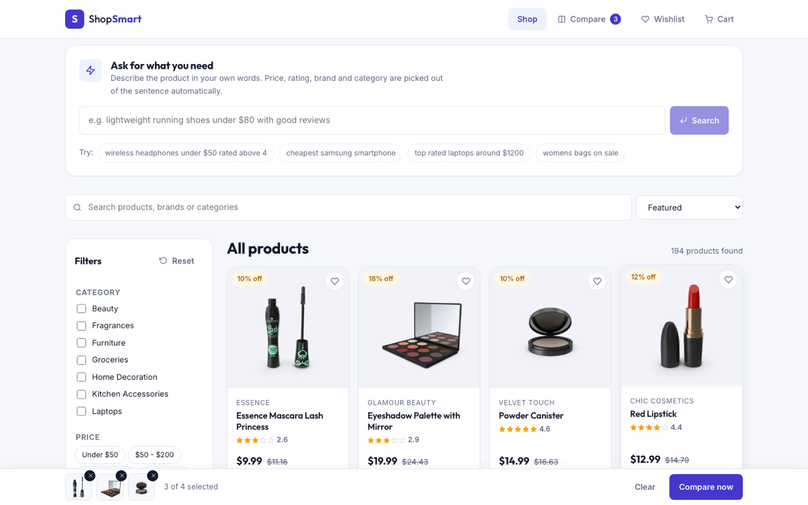
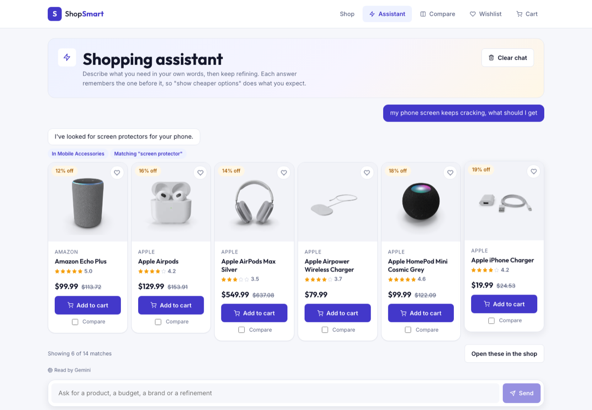
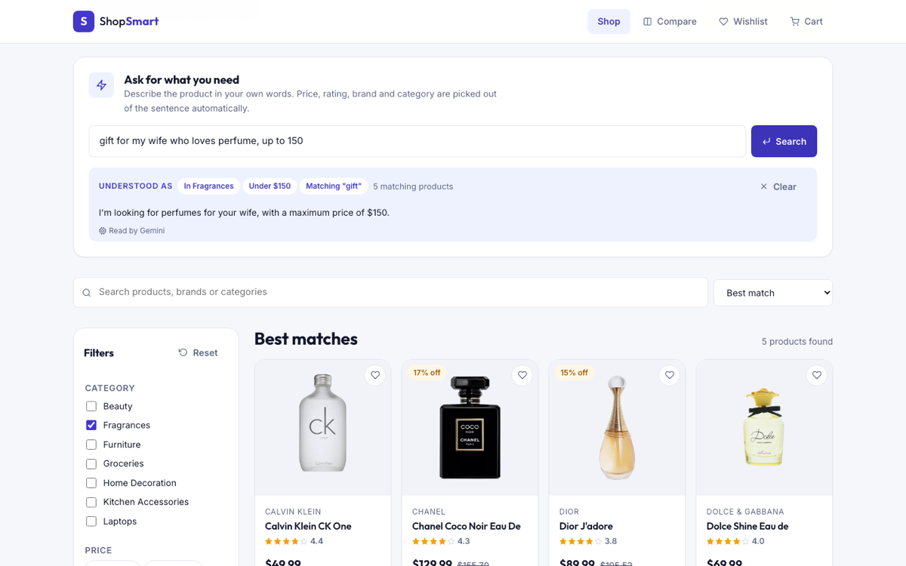
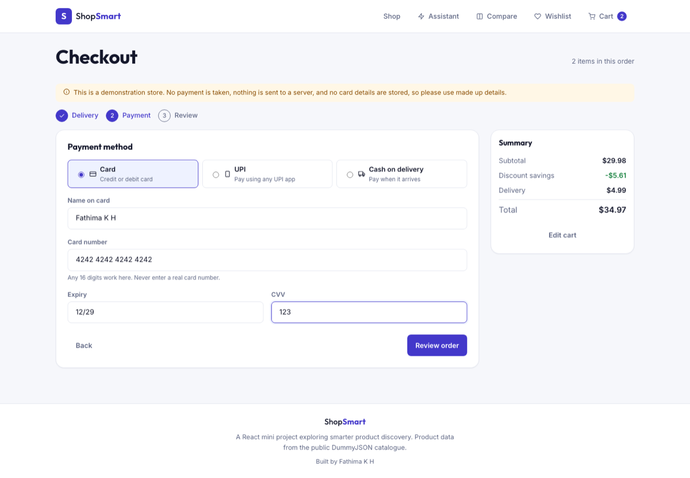
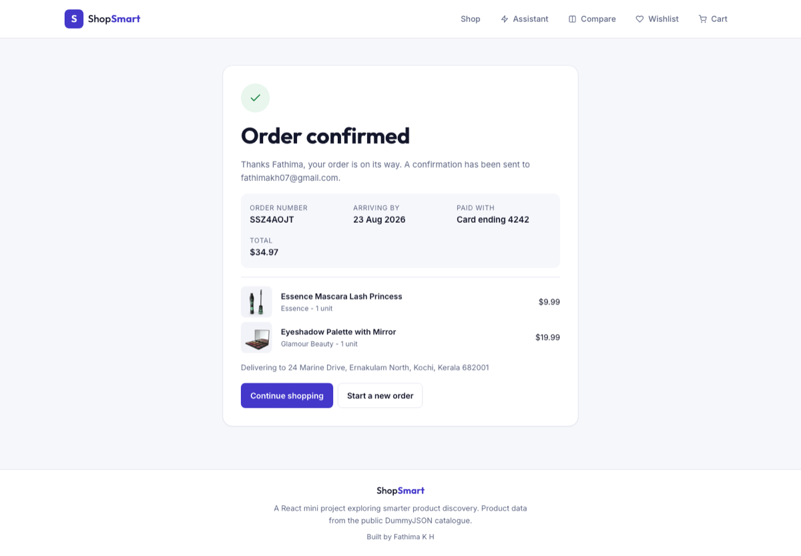
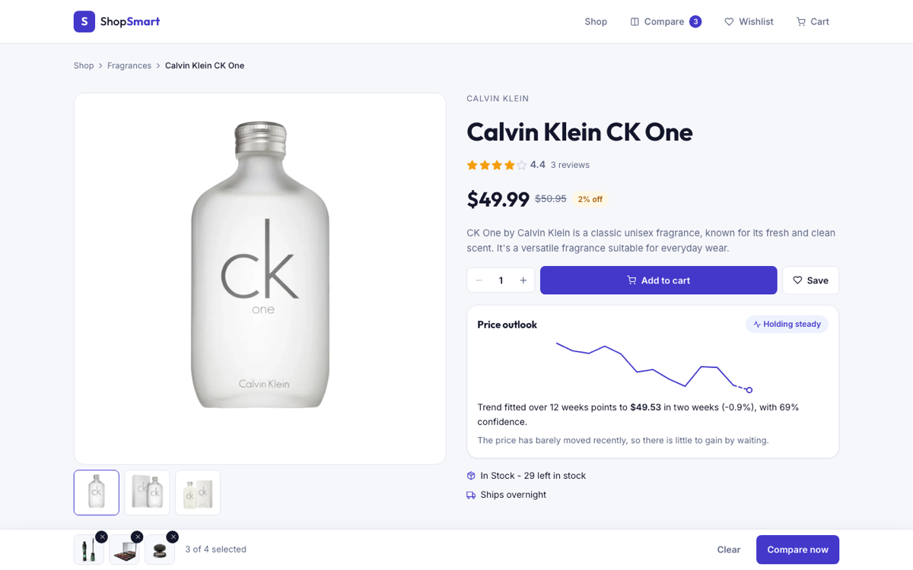
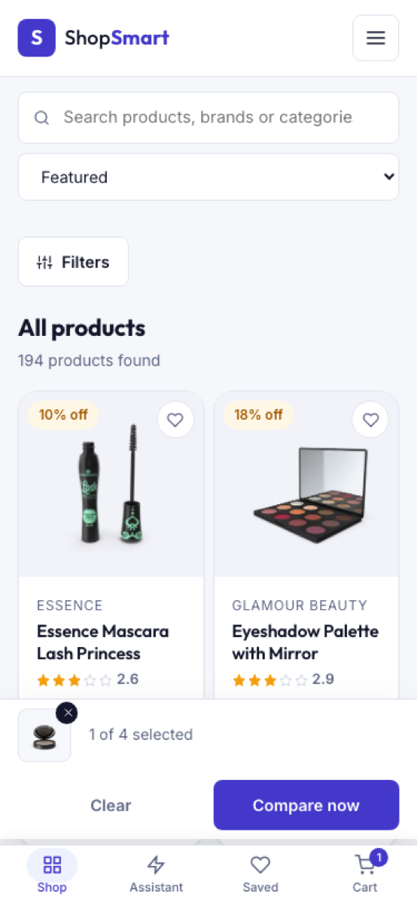

# ShopSmart - AI Shopping Assistant

An e-commerce product discovery app built with React. Along with the usual browsing,
filtering and cart features, it understands a shopping request written as a normal
sentence, suggests products based on what you looked at, and estimates where a price
is heading.

## 🔗 Live Demo

Add the deployed link here after the first deploy, for example
`https://shopsmart.vercel.app`.

## 📖 Description

ShopSmart is a front-end shopping assistant for anyone who finds it tiring to translate
"a decent pair of wireless headphones under fifty dollars" into six separate filter
clicks. It loads a live catalogue of 194 products, lets you narrow it down by category,
price, brand and rating, compare a shortlist side by side, and keep a cart and wishlist
that survive a page refresh.

## ✨ Features

- **Product catalogue** - responsive grid of products with images, prices, discounts and ratings, loaded from a public API with skeleton loading states
- **Advanced filtering** - filter by category, brand, price band or custom price range, and minimum customer rating
- **Search and sort** - debounced keyword search plus seven sort options including price, rating, popularity and newest
- **Product details** - image gallery, full specifications, customer reviews, stock and shipping information
- **Comparison tool** - line up to four products side by side with the lowest price and best rated options flagged
- **Shopping cart** - quantity controls, discount savings, free delivery threshold, saved to local storage
- **Demonstration checkout** - a three step delivery, payment and review flow with live validation, ending in an order confirmation with an order number and delivery date
- **Wishlist** - save products for later and move the whole list to the cart in one click
- **Responsive design** - tested at 375px, 768px and 1920px
- **AI: shopping assistant page** - a dedicated chat where you describe what you need, see the products inline, and keep refining across turns
- **AI: natural language search** - the Gemini API works out the filters from a sentence, with an on-device parser as backup
- **AI: recommendation engine** - "Recommended for you" and "Similar products" built from what you view, save and buy
- **AI: price drop prediction** - a fitted price trend that estimates the price two weeks out

## 🎯 Project Goals

The aim was to build a complete React application from scratch rather than assemble one
from tutorials: component structure, hooks, context, routing, responsive CSS and
accessibility all done by hand. The second goal was to make the AI features genuinely
functional instead of decorative, which meant writing the query parser, the TF-IDF
similarity model and the regression forecast rather than calling a paid API and hoping
for the best.

## 🛠 Technologies Used

- **Frontend:** React 18 with hooks (useState, useEffect, useMemo, useCallback, useContext)
- **Build tool:** Vite
- **Styling:** CSS3 with custom properties, one stylesheet per component, an 8px spacing scale and a three colour palette
- **Routing:** React Router DOM v6
- **Icons:** React Icons (Feather set)
- **APIs:** [DummyJSON Products API](https://dummyjson.com/docs/products) for the catalogue, [Google Gemini API](https://ai.google.dev/) (`gemini-2.5-flash`) for query understanding
- **AI:** Gemini with structured JSON output for natural language search, plus models written from scratch in plain JavaScript - a rule based query parser, TF-IDF vectors with cosine similarity, and least squares linear regression
- **Deployment:** Vercel or Netlify

## 🤖 AI Integration

Three AI features power the app. Two of them run entirely in the browser; the third calls
the Gemini API when a key is available. Each one is described below with the idea behind it.

### 1. Shopping assistant and natural language search

Type a request the way you would say it out loud and the filters are worked out for you.
Asking from the shop page opens the **assistant page** (`/assistant`), a chat where each
answer carries the reply, the filters it used as chips, the matching products as real
cards you can add to the cart from, and a button to open the full result set back in the
shop with those filters applied.

Answers build on each other. The previous request and its filters are sent with the next
message, so a follow-up refines instead of starting over:

> **you** gift for my wife who loves perfume, up to 150
> **assistant** I'm looking for perfumes for your wife, with a maximum price of $150.
> *In Fragrances · Under $150* - 5 matches
>
> **you** show cheaper options
> **assistant** I'm looking for cheaper perfume options for your wife.
> *In Fragrances · Under $150*, now sorted by price

The conversation is kept in local storage, so leaving the page and coming back does not
lose it. Two engines sit behind the box.

**Gemini (`src/services/gemini.js`).** The request goes to `gemini-2.5-flash` along with
the exact category slugs and brand names in the catalogue. A response schema forces the
model to reply with structured JSON rather than prose, and thinking is disabled to keep
the round trip near a second. Its answer is never trusted directly: categories and brands
are checked against the real catalogue, prices are sanity checked and swapped if reversed,
the rating is clamped to 0-5 and the sort key must be one the app actually supports. This
is what handles a request with no product words in it at all:

| What you type | What Gemini extracts |
| --- | --- |
| `my phone screen keeps cracking, what should I get` | Mobile Accessories, keyword "screen protector" |
| `gift for my wife who loves perfume, up to 150` | Fragrances, max price 150, keyword "gift" |
| `best rated laptop for college, budget around 900` | Laptops, max price 900, sorted by rating |

**On-device parser (`src/utils/nlpSearch.js`).** If no API key is configured, the request
fails or the model returns nothing usable, the same sentence is parsed locally instead,
and `mergeWithPrevious` carries the earlier filters over so follow-ups still work.
It recognises price phrases (`under`, `over`, `between`, `around`, `1k`), rating phrases,
discount wording, sort intent, gender hints and around 90 everyday product words:

| What you type | What it extracts |
| --- | --- |
| `wireless headphones under $50 rated above 4` | Mobile Accessories, max price 50, min rating 4 |
| `cheapest samsung smartphone` | Smartphones, brand Samsung, sorted by price ascending |
| `womens shoes on sale between 20 and 80` | Womens Shoes, discounted only, price 20 to 80 |

Whichever engine answers, the leftover words become keywords and products are ranked
against them with TF-IDF cosine relevance (`src/utils/textIndex.js`), so a rare word like
"titanium" counts for far more than a common one. The result is always shown back as
chips with a label saying whether Gemini or the device read the sentence, so the shopper
can see why the product list changed.

### 2. Recommendation engine

`src/utils/recommend.js` builds a weighted TF-IDF vector for every product from its
title, brand, category, tags and description. "Similar products" on the detail page is
the cosine similarity between two products, topped up for a matching category, brand
and a similar price. "Recommended for you" merges the vectors of everything you viewed,
wishlisted or added to the cart into a single taste profile, weights recent activity
higher, and returns the closest products you have not seen yet.

### 3. Price drop prediction

`src/utils/pricePredict.js` reconstructs a twelve week price history for each product
from its current and pre-discount price, using a seeded generator so the chart is stable
between renders. A least squares regression is fitted to that history, extended two
weeks forward, and the R squared value of the fit becomes the confidence figure. The
product page shows the trend line, the dashed forecast, and a plain English verdict:
likely to drop, likely to rise or holding steady.

**Challenges faced.** Getting a language model to return something a UI can use was the
first problem: free text answers were impossible to filter with, so the request moves to
a response schema and every field of the reply is validated against the catalogue before
it touches the filters. A model that invents a category it likes the sound of should not
be able to empty the product grid. The second problem was not depending on it, since the
key can be missing and the network can fail, which is why the rule based parser stayed in
the project as a fallback rather than being deleted once Gemini worked. Writing that
parser had its own trap: matching on single words alone produced nonsense, for example
"accessories" pulling in mobile accessories when the shopper typed "gym accessories", so
the word lists were narrowed and word boundary matching was used everywhere. The
recommendation scoring needed limiting too, as price similarity alone was ranking a chair
next to a smartphone, so price is only allowed to refine products that already share a
category, brand or vocabulary.

## 🚀 Setup Instructions

### Prerequisites

- Node.js v16 or higher
- npm

### Installation Steps

1. Clone the repository

   ```bash
   git clone https://github.com/fathimakh/ShopSmart.git
   ```

2. Navigate to the project directory

   ```bash
   cd ShopSmart
   ```

3. Install dependencies

   ```bash
   npm install
   ```

4. Add a Gemini API key (optional)

   ```bash
   cp .env.example .env.local
   ```

   Put a key from [Google AI Studio](https://aistudio.google.com/apikey) in
   `.env.local` as `VITE_GEMINI_API_KEY`. The file is git ignored and is never
   committed. Skip this step and natural language search falls back to the parser
   that runs in the browser, so nothing breaks without a key.

   When deploying, add the same variable in the Vercel or Netlify project settings.

5. Start the development server

   ```bash
   npm run dev
   ```

6. Open `http://localhost:3000` in your browser

The catalogue API is public and needs no key.

To create a production build, run `npm run build` and preview it with `npm run preview`.

## 🧾 About the checkout

The checkout is a working front-end flow, not a real shop. It walks through delivery
details, a payment method and a review screen, validates every field as a real form
would, then confirms the order with an order number, an estimated delivery date and a
summary of what was bought, and empties the cart.

Because it is a demonstration:

- nothing is ever sent to a server, and there is no server to send it to
- a banner at the top of the page says so, and the card field warns against entering a
  real card number
- only the last four digits of the card are kept, and only in this browser's local
  storage, so the confirmation can say "card ending 4242"
- cash on delivery and UPI are offered too, so the flow can be demonstrated without
  typing card details at all

## 📁 Project Structure

```
src/
├── components/          one folder per component, JSX and CSS together
│   ├── AiSearchPanel/
│   ├── CompareBar/
│   ├── EmptyState/
│   ├── FilterPanel/
│   ├── FormField/
│   ├── Footer/
│   ├── Header/
│   ├── PricePrediction/
│   ├── ProductCard/
│   ├── ProductGrid/
│   ├── QuantityStepper/
│   ├── RecommendationRow/
│   ├── SearchBar/
│   └── StarRating/
├── context/
│   ├── CatalogContext.jsx    catalogue fetching and derived filter options
│   └── ShopContext.jsx       cart, wishlist, comparison and view history
├── hooks/
│   ├── useDebounce.js
│   ├── useLocalStorage.js
│   ├── usePageTitle.js
│   └── useShoppingAssistant.js   the conversation, its memory and its answers
├── pages/
│   ├── Assistant.jsx
│   ├── Cart.jsx
│   ├── Checkout.jsx
│   ├── Compare.jsx
│   ├── Home.jsx
│   ├── NotFound.jsx
│   ├── ProductDetails.jsx
│   └── Wishlist.jsx
├── services/
│   ├── api.js                fetching and normalising products
│   ├── fallbackProducts.js   offline snapshot of the catalogue
│   └── gemini.js             Gemini query understanding with validation
├── utils/
│   ├── checkoutValidation.js form validation and card formatting
│   ├── filters.js            filtering, searching and sorting
│   ├── format.js             price, date and text formatting
│   ├── nlpSearch.js          natural language query parsing
│   ├── pricePredict.js       price history and regression forecast
│   ├── recommend.js          similarity and recommendations
│   └── textIndex.js          TF-IDF index shared by search and recommendations
├── App.jsx
├── index.css                 design tokens and shared styles
└── main.jsx
```

## 📱 Responsive Design

Tested and working on:

- Mobile devices from 375px, with a bottom navigation bar for shop, assistant, saved items and cart, a collapsible filter drawer and a two column product grid
- Tablets from 768px
- Desktops from 1024px, with a sticky filter sidebar

## 📸 Screenshots

| Shop page with filters and AI search |
| --- |
|  |

| Shopping assistant answering a vague request |
| --- |
|  |

| Natural language search answered by Gemini |
| --- |
|  |

| Checkout | Order confirmation |
| --- | --- |
|  |  |

| Product details with price outlook | Mobile layout |
| --- | --- |
|  |  |

## 🎨 Design Choices

- **Three colours, two fonts.** Indigo for actions, amber for deals and ratings, and a
  neutral grey scale. Outfit for headings, Inter for body text. Everything is defined as
  CSS custom properties in `index.css` so the theme can be changed in one place.
- **8px spacing scale.** All padding, gaps and margins come from `--space-1` to
  `--space-7`, which keeps rhythm consistent without eyeballing values.
- **Plain CSS per component.** Each component owns its stylesheet next to its JSX, so
  styles stay easy to trace and nothing leaks between components.
- **Thumb reachable navigation on phones.** Below 768px the links move into a fixed
  bottom bar with live cart and wishlist counts, which is where a phone user's thumb
  already is. The comparison tray and the assistant input sit above it rather than under
  it.
- **Code split by route.** Only the shop page ships in the first bundle. The other pages
  and the 65KB offline catalogue snapshot are fetched when they are actually needed, which
  keeps the initial download about a third smaller.
- **Two contexts instead of a state library.** `CatalogContext` owns server data,
  `ShopContext` owns the shopper's own data. Redux would have been more machinery than
  this app needs.
- **Offline fallback.** If the catalogue request fails, a saved snapshot of the products
  is used and a notice is shown, so the deployed site never renders an empty page.
- **Chat as a page, not a widget.** A floating chat bubble would have squeezed product
  cards into a corner. A full page lets an answer show six real product cards with working
  cart and compare controls, and hand the whole result set back to the shop.
- **Explainable AI.** The parsed query is displayed as chips, the panel says which engine
  read the sentence, and the forecast shows its confidence, because a suggestion the user
  cannot understand is a suggestion they will not trust.
- **No hard dependency on the model.** Gemini improves the search but is never required.
  Without a key, without network, or on an unusable answer, the local parser takes over
  and the shopper sees no error.

## 🐛 Known Issues

- The price history behind the forecast is reconstructed from the discount data the API
  provides, since no real historical prices are available. The regression is real; the
  input series is derived.
- Checkout is a demonstration. Orders are confirmed in the browser and never reach a
  payment provider, which is the expected scope for a front-end only project.
- Very broad natural language queries such as "something nice for my sister" have no
  filters to extract and fall back to keyword relevance alone.
- The assistant answers from the catalogue it has. Asking for something the shop does not
  stock, such as a screen protector, returns the closest category it can rather than
  admitting there is no exact match.
- Any API key used by a front-end application is visible in the built JavaScript, which
  is a property of the stack rather than of this project. The Gemini key is kept out of
  the repository in `.env.local`, and a key used for a public deployment should be
  restricted to the deployed domain in the Google Cloud console and rotated if it leaks.

## 🔮 Future Enhancements

- A MERN back end with real user accounts, so the cart, wishlist and conversation follow the user across devices
- Real price history stored per product, which would replace the reconstructed series with actual data
- Collaborative filtering once there is more than one user's behaviour to learn from
- Voice search using the Web Speech API
- Paginated or virtualised product loading for catalogues much larger than 194 items

## 👤 Author

**Fathima K H**

- GitHub: [@fathimakh](https://github.com/fathimakh)
- Email: fathimakh07@gmail.com

## 📄 License

This project is open source and available under the [MIT License](LICENSE).

## 🙏 Acknowledgments

- [DummyJSON](https://dummyjson.com) for the free product catalogue and images
- [React Icons](https://react-icons.github.io/react-icons/) for the Feather icon set
- [Google Fonts](https://fonts.google.com) for Outfit and Inter
- [Google AI Studio](https://aistudio.google.com) for the Gemini API used by the search box
- The React documentation, which was the reference for the hooks patterns used here
